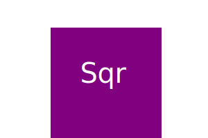
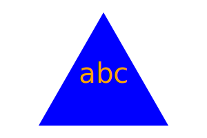

# SVG Logo Maker

## License:

## Table of Contents

- [License](#license)
- [Description](#description)
- [Installation](#installation)
- [Usage](#usage)
- [Examples](#examples)
- [Testing](#testing)
- [Contact Information](#contact-information)

## Description:

This project generates an SVG Logo based on user inputs.

## Installation:

Use `npm install` in CLI.

## Usage:

Use `node index.js` in CLI. Alternatively watch the walkthrough video by clicking this link:
https://drive.google.com/file/d/1WmMtpA3LaWa3WmynoEu26S5ObIUfAJTp/view

## Examples:

## Testing:

Use `npm run test` in CLI.

## Contact information:

- Github: [edwardlui1](https://github.com/edwardlui1)
